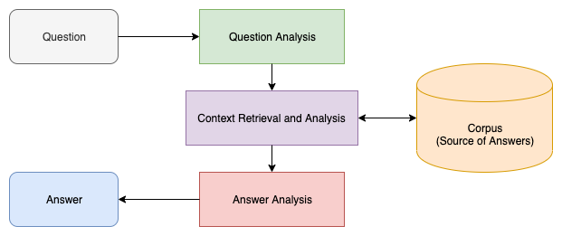

# Question answering system

Question answering is a computer science discipline within the fields of information retrieval and natural language processing, which is concerned with building systems that automatically answer questions posed by humans in a natural language.

The objective here is to build a Question answering system using the seq2seq approach.

### SQuAD Dataset

Stanford Question Answering Dataset (SQuAD) is a reading comprehension dataset, consisting of questions posed by crowdworkers on a set of Wikipedia articles, where the answer to every question is a segment of text, or span, from the corresponding reading passage, or the question might be unanswerable.

We can download the dataset from [here](https://rajpurkar.github.io/SQuAD-explorer/)
